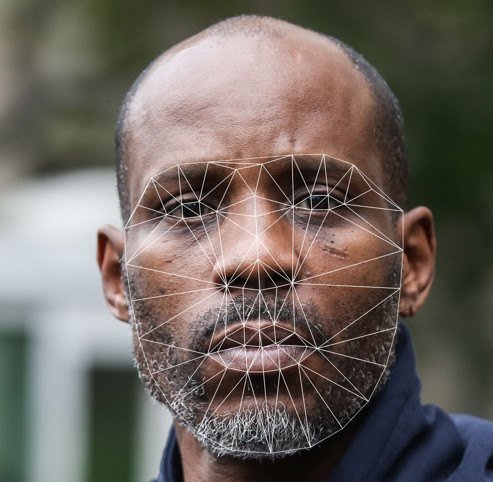

<h1 align="center">Faceitize</h1>

    
    

<i>Map faces to other faces</i>

The magical face to face replacer.

More details on setting up and running to come.

## Note
The Dockerfile uses a facial recognition model that is copyrighted and not approved for commercial use.  Either train your own or find a different one if you plan on using this package.
